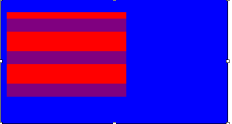

###Color Block Assignment 

Create a file called “[yourname]colorblock.html”, and create webpages that lok like the images below.

1) Try putting three ‘children’ in the parent element by positioning them absolutely.  Your screen should look something like this (the blocks don’t need to be in a row, but there need to be three blocks in the parent element):



2) What happens if you set a child elements’ left, right, top AND bottom (but NOT width or height)? Write your answer at THE END of your HTML Document


###Bonus Problems


1) Create a webpage that looks like this (you can use whatever colors you want!). You can save it as “[yourname]colorblock2.html”




2) Now, create a webpage that looks like this.  You can save it as “[yourname]colorblockhw3.html”



3) Get creative!  Make a file with as many blocks and colors as you want.  You can save it as “[yourname]colorblock4.html”